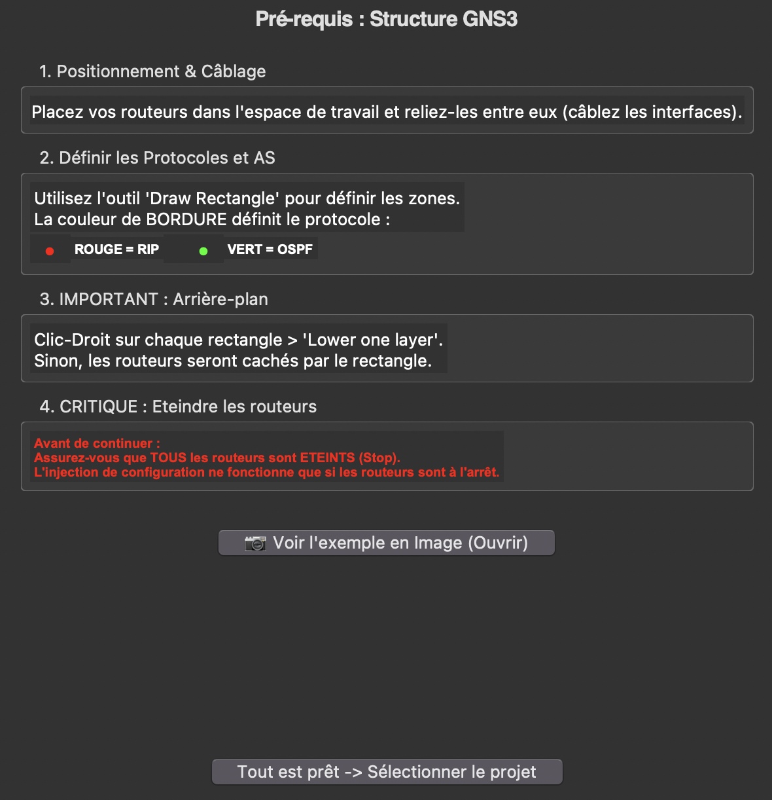
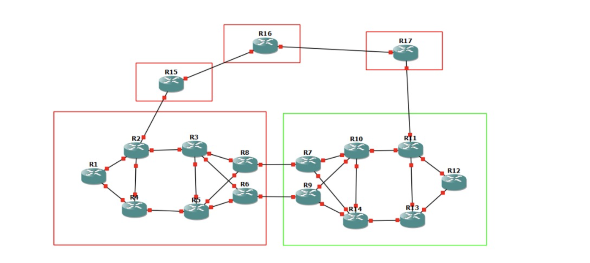

# GNS3 Routing Configuration Automation

Portfolio project developed by **Leno Renaud, Hector Ernoult, Théodore Bonnier, Jules Gruffaz**.

This project automates Cisco c7200 router configuration inside a GNS3 topology using Python scripts and Jinja2 templates.  
It provides a GUI workflow that helps generate and inject routing configurations (RIP / OSPF / BGP) into a complete lab architecture.

---

## Project Overview

### Goal

Build a reliable automation pipeline for multi-AS GNS3 labs, reducing manual router configuration and making network experiments reproducible.

### Key Features

- GUI-based workflow with usage guidance.
- Automatic topology processing and configuration generation.
- Templated router configs with Jinja2.
- Automated config injection into router files.
- Support for mixed routing designs (RIP, OSPF, BGP).
- Experimental Gao-Rexford community handling.

### Tech Stack

- **Python**
- **Tkinter** (GUI)
- **Jinja2** (templating)
- **GNS3** project parsing and config injection

---

## Screenshots

### GUI Interface



### Configuration Result in Router CLI



### GNS3 Usage Tutorial View


---

## Repository Structure

```text
main.py                         # Entry point (GUI launcher)
utils.py                        # Utility helpers
topology.json                   # Topology data source
configs/                        # Generated router configurations
get_topology/                   # Topology extraction logic
gen_config_bgp_rip/             # BGP + RIP generation module
gen_config_bgp_ospf/            # BGP + OSPF generation module
injection_cfgs/                 # Config injection module
architecture_finale/            # GNS3 project files
Documentation/                  # Additional technical docs
assets/                         # README screenshots
```

---

## Setup & Configuration (English)

### 1) Prerequisites

- Python 3.10+ recommended
- GNS3 installed and working
- Cisco c7200 images already available in GNS3

### 2) Clone / import the full project

The scripts rely on the repository structure, so keep the complete folder tree unchanged.

```bash
git clone <your-repo-url>
cd projet-gns
```

### 3) Install dependencies

```bash
pip install jinja2
```

`tkinter` is usually bundled with Python on many systems. If missing, install it from your OS package manager.

### 4) Prepare your GNS3 topology

- Open your GNS3 project.
- Draw background rectangles around each AS:
	- **Red** rectangle for RIP domains
	- **Green** rectangle for OSPF domains
- Colors must be pure values for detection (example: red = RGB `255, 0, 0`).

### 5) Run the application

```bash
python main.py
```

Then:
- Select your GNS3 project folder from the GUI.
- Follow the guided steps.
- Wait for the success message confirming configuration generation/injection.

### 6) Important runtime conditions

- All routers must be **powered off** before injection.
- Existing startup configurations can be overwritten by the process.

---

## Known Limitations

- Gao-Rexford communities support is experimental.
- You can define OSPF metrics on links between RIP routers in the GUI, but this does not affect final configs.

---

## Portfolio Notes

This project demonstrates:

- Network automation design
- Routing protocol orchestration (RIP/OSPF/BGP)
- Template-driven infrastructure generation
- Practical tooling for reproducible lab deployments
- Team collaboration in an academic engineering context
